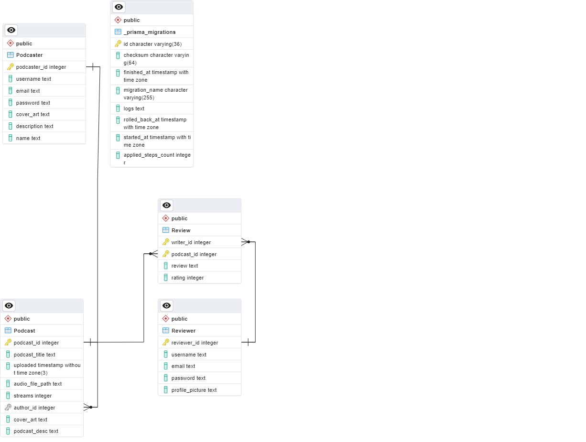

# Spotiplay REST

Daftar Konten:
- [Deskripsi Singkat Web Service](#desc)
- [Skema Basis Data](#db)
- [Endpoint API](#endpoint)
- [Pembagian Tugas ](#assign)

## Deskripsi Singkat Web Service 

Web Service REST pada Spotiplay akan menangani fitur konten premium dari Spotiplay, yaitu podcast dan fitur komentar tiap podcast. Service dibuat dengan ExpressJ, PostgreSQL, Prisma, dan Docker. Service ini memungkinkan pengguna untuk melakukan pendaftaran dan login sebagai podcaster/reviewer, mengunggah dan mengatur podcast baru, serta membuat review.

Anggota kelompok:
<table>
  <tr>
    <td align="center" colspan="3">No. Kelompok : 30</td>
  </tr>   
  <tr>
    <td align="center">NIM</td>
    <td align="center">Nama</td>
    <td align="center">Username</td>
  </tr>
  <tr>
    <td align="center">13521076</td>
    <td align="center">Moh. Aghna Maysan Abyan</td>
    <td align="center"><a href=https://gitlab.informatika.org/AghnaAbyan>AghnaAbyan</a></td>
  </tr>
    <tr>
    <td align="center">13521146</td>
    <td align="center">Muhammad Zaki Amanullah</td>
    <td align="center"><a href=https://gitlab.informatika.org/ZakiAmanullah>ZakiAmanullah</a></td>
  </tr>
  <tr>
    <td align="center">13521155</td>
    <td align="center">Kandida Edgina Gunawan</td>
    <td align="center"><a href=https://gitlab.informatika.org/kandidagunawan>kandidagunawan</a></td>
  </tr>
</table>

## Skema Basis Data 
||
|:--:|
|Skema Basis Data REST|
## Endpoint API 
Berikut adalah *Endpoint* API yang digunakan pada program REST:

1. Podcast
    - /api/v1/podcast
    - /api/v1/podcast /:id 
    - /api/v1/podcast/:id/:reviewer_id
    - /api/v1/podcast/:podcaster_id
    - /api/v1/podcast/:podcast_id

2. Podcaster
    - /api/v1/podcaster
    - /api/v1/podcaster/:id
    - /api/v1/podcaster/edit/:id

3. Review
    - /api/v1/review/:id
    - /api/v1/review/:writer_id/:podcast_id

4. Register
    - /api/v1/register/reviewer
    - /api/v1/register/podcaster

5. Login
    - /api/v1/login/

6. Logout
    - /api/v1/logout

7. Upload
    - /api/v1/upload

8. Subscription
    - /api/v1/subscription/:id
    - /api/v1/subscription/accept
    - /api/v1/subscription/reject

9. User
    - /api/v1/user

## Pembagian Tugas 
- Backend Fungsi login = 13521155
- Backend Fungsi register = 13521155
- Backend Fungsi logout = 13521155
- Backend Fungsi podcast = 13521146
- Backend Fungsi podcaster = 13521146
- Backend Fungsi review = 13521146
- Backend Fungsi subscription = 13521146
- Backend Fungsi upload = 13521146
- Backend Fungsi user = 13521146
- README.md REST = 13521076
